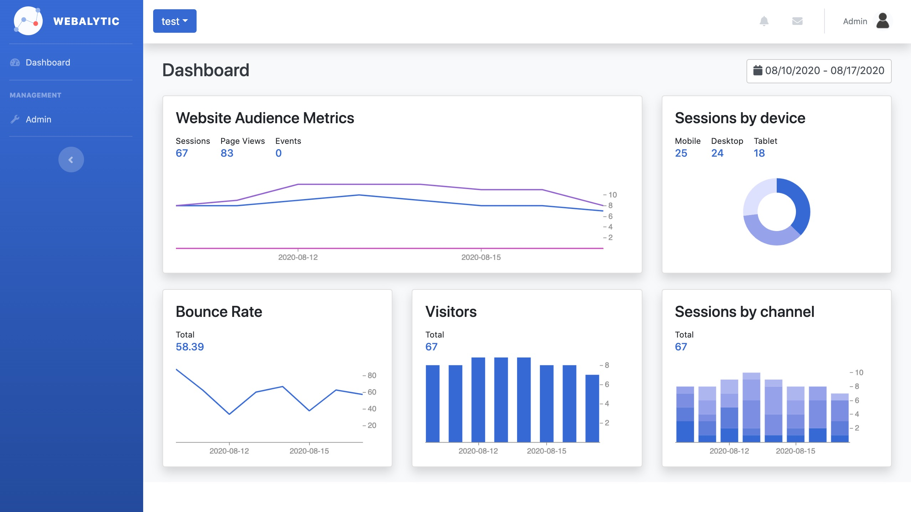
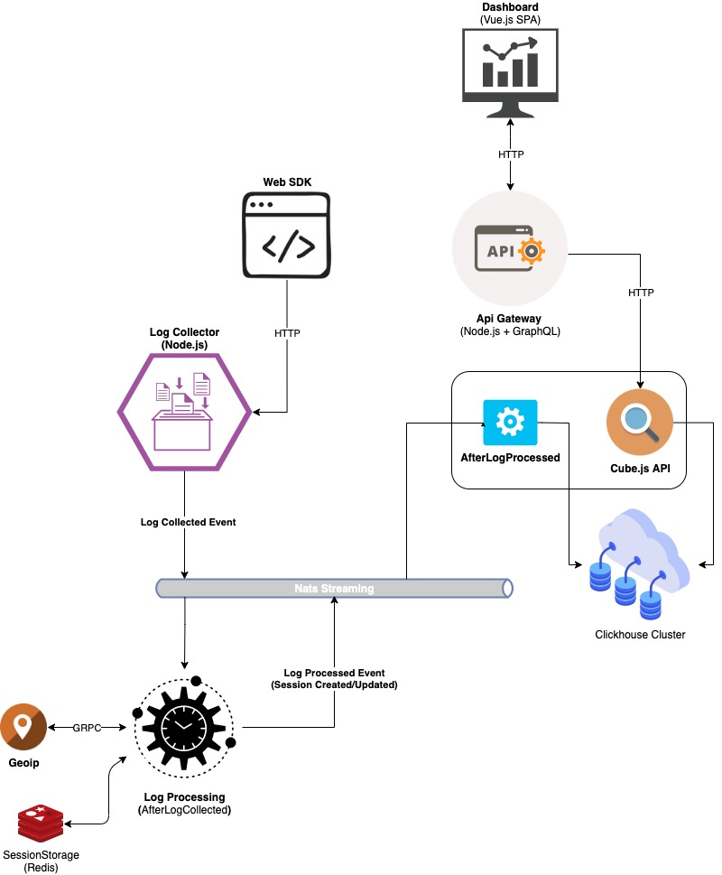

# Webalytic

This is open source web analytics platform, tracks and reports website traffic.  



## Features 

- Support [Measurement Protocol](https://developers.google.com/analytics/devguides/collection/protocol/v1?hl=ru) (so far partial)
- Collect client hits (page views, events, transactions)
- Processes the client-interaction data with the configuration data 
- Provides access to all the processed and **RAW** data
- GeoNetwork data parsing with [maxmind](https://www.maxmind.com)
- Produce domain events to [Nats Streaming](https://docs.nats.io/nats-streaming-concepts/intro) (create your custom subscribers module for any goals, example anti-fraud detector)
- Microservices architecture, with shared [protobuf contracts](https://github.com/webalytic/protorepo)
- Dockerfiles and docker-compose deploy

## How does it work?

The platform seeks to repeat processing logic described by Google Analytics, following articles should be helpful for understanding core terms:

- [How a web session is defined in Analytics](https://support.google.com/analytics/answer/2731565?hl=en)
- [Campaigns and traffic sources](https://support.google.com/analytics/answer/6205762?hl=en)

Microservice architecture, project includes following packages:
  - [Dashboard](./src/dashboard/README.md), Vue.js SPA
  - [Api-gateway](./src/api-gateway/README.md)
  - [Configuration](./src/configuration/README.md)
  - [Log-collector & Web SDK](./src/log-collector/README.md)
  - [Log-processing](./src/log-processing/README.md)
  - [Geoip](./src/geoip/README.md)
  - [Data-storage](./src/data-storage/README.md) with [Cube.JS](https://cube.dev/) API 

  

## Run with docker-compose

```bash
# Create network app 
docker network create app

# Start database and infrastructure containers
# For correct work Geoip service 
# you must copy GeoIP2-City.mmdb to ~/deploy/docker-compose/datasources/maxmind
docker-compose -f ~/deploy/docker-compose/datasources/docker-compose.yml up -d

# Start applications containers
docker-compose -f ~/deploy/docker-compose/docker-compose.yml up -d

# Vue dashboard on
http://127.0.0.1:80/

# Api-gateway on
http://127.0.0.1:80/api
```

### Environment variables

You can find list of all env variables in sample [env file](./deploy/docker-compose/.env)

## Roadmap

- [x] Base test coverage and CI/CD configs

- [x] Resources service, create resource and invariants for log-collector

- [x] Base analytics dashboard: Audience, sessions by device/by channel, visitors, bounce rate. Upgrade Cube.Js schema, more metrics and dimensions

- [ ] Conversions service: 
  - Goals, conversions and funnels
  - Grouping channel
  - Attribution (Last Click, Time Decay, Liner, Position Based, First Click)

- [ ] Custom metrics and dimensions

- [ ] Custom widget builder

- [ ] Identity and access management service

- [ ] Smart SDK

- [ ] Kubernetes deploy with Helm